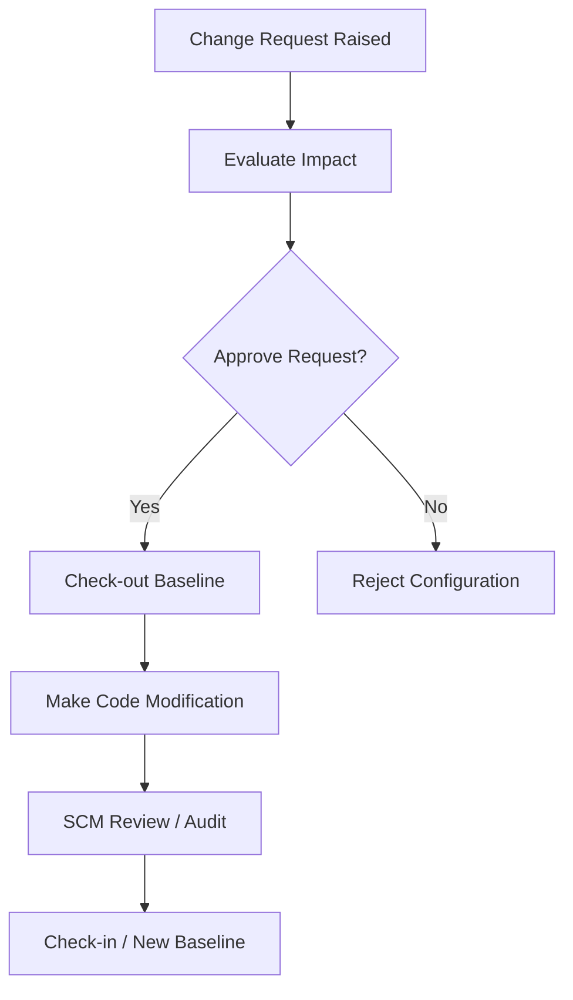
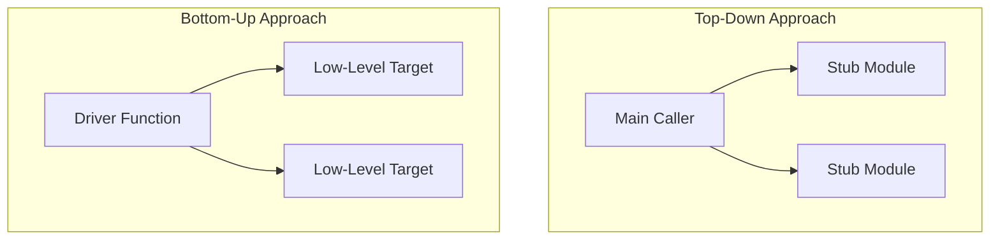
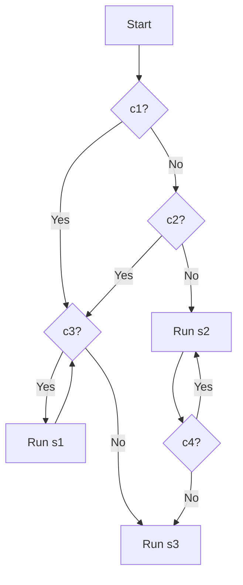
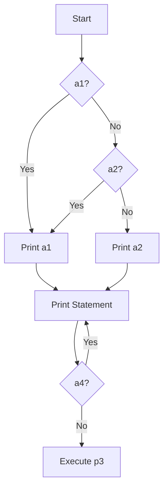

# Software Engineering Solved Question Bank

*(Note: Contains solutions for 2-mark and 5-mark questions based on the SE ISE 2 syllabus. Mixed mark questions are included for comprehensive coverage. 10-mark questions are skipped as requested.)*

---

## Module 4: Design Engineering

### 🔹 2 Marks Questions

**1. Apply the concept of User Interface Design and justify its purpose in improving user experience.**
**Answer:** User Interface (UI) Design describes how the software communicates within itself, with other systems, and with human users. Its purpose in improving user experience is to ensure intuitive interaction, shorten the learning curve, and provide clear information presentation, which translates directly to higher user satisfaction and fewer operational errors.

**2. Explain the goal of Data Design and illustrate its role in software architecture.**
**Answer:** The goal of Data Design is to transform data models (like ER diagrams) into actionable data structures and databases. Its role in software architecture is foundational; it dictates how information is stored, accessed, and managed, ensuring that architecture acts on well-structured, optimized data representations.

**3. Apply the principle of Refinement in Component-Level Design and discuss its significance.**
**Answer:** Refinement transforms high-level architectural structural elements into detailed procedural descriptions. Its significance lies in enabling step-by-step elaboration, allowing developers to focus on granular algorithms and data structures sequentially without being overwhelmed by the overall architecture.

**4. Describe the concept of Information Hiding in design and summarize how it supports encapsulation.**
**Answer:** Information Hiding dictates that modules should be designed so that their internal data and algorithms are inaccessible to other modules that don't absolutely need them. It supports encapsulation by exposing only necessary interfaces while protecting the internal state from unintended, unauthorized external modifications.

**5. Distinguish between the key elements of a design model and justify each element's role.**
**Answer:**
- **Data Design:** Maps models to databases (Foundation).
- **Architecture Design:** Defines relationships among structural elements (Framework).
- **UI Design:** Maps scenarios to user interactions (User facing).
- **Component-Level Design:** Transforms architectural elements to procedural details (Algorithm logic).

---

### 🔹 5 Marks Questions

**6. Apply the principle of modularity to design a simple calculator application and demonstrate how modular decomposition improves maintainability.**
**Answer:** 
Modularity compartmentalizes software into single-purpose components. For a calculator:
- **Module 1 (UI):** Handles user input (button clicks) and displays results.
- **Module 2 (Parser):** Interprets the mathematical expression.
- **Module 3 (Core Logic):** Contains isolated functions for `add()`, `subtract()`, `multiply()`, `divide()`.
**Maintainability Improvement:** If the `divide()` logic needs to handle division-by-zero errors, only the core logic module is updated, without risking breaking the UI or Parser. High cohesion and low coupling make bug tracking simple.

**7. Apply the concept of abstraction to design a high-level architecture for a banking system and illustrate how abstraction layers reduce complexity.**
**Answer:**
Abstraction focuses on problem-solving without lower-level details. 
- **Top Layer (User Abstraction):** Mobile App interface (users just see their balance and transfer buttons).
- **Middle Layer (Procedural Abstraction):** API Gateways handling transaction routing.
- **Bottom Layer (Data Abstraction):** Database clusters storing encrypted ledgers.
**Complexity Reduction:** The UI designer doesn't need to know SQL queries (Data abstraction), and the database engineer doesn't need to know about UI states. This layered approach prevents cognitive overload.

**8. Analyze the impact of poor User Interface Design on user satisfaction and system usability. Examine real-world failure cases.**
**Answer:**
Poor UI design leads to a steep learning curve, increased operational errors, and immense frustration. If interfaces lack conformity and intellectual distance is high, system usability drops significantly.
**Real-World Failure Form:** A complex medical software interface with cluttered buttons may cause a doctor to select the wrong medication dosage. The lack of standard conventions (like red for 'Cancel' and green for 'Confirm') further exacerbates catastrophic, sometimes fatal, user errors.

**9. Apply different design principles to a software system and construct a structured explanation of each principle with practical examples.**
**Answer:**
- **Traceability:** Ensuring an e-commerce 'Cart' feature maps directly back to the SRS requirement.
- **Minimize Intel Distance:** A digital calendar app should look and flow like a physical wall calendar.
- **Uniformity & Integration:** Consistent navigation bars and typography across all pages of a website.
- **Accommodate Change:** Using modular plugins so a new payment gateway can be added later without rewriting the checkout system.

**10. Analyze the role of abstraction in the software design process. Examine how it guides designers from high-level to detailed specifications.**
**Answer:**
Abstraction allows designers to create top-down models. They start with system-level models (Data abstraction) representing concepts like "User" and "Order". They then move downwards to formulate interfaces (Procedural abstraction) defining methods like "ProcessOrder()". Finally, they drill down to low-level execution logic (Control abstraction) determining loops and algorithms. This hierarchical breakdown guides developers efficiently without being overwhelmed.

**11. Design a modular architecture for a student management system by applying functional independence and evaluating cohesion and coupling.**
**Answer:**
- **Modules Breakdown:** `Admission`, `Attendance`, `Grading`, and `Library`.
- **Functional Independence:** Each module performs a single task. 
- **Cohesion (Goal: High):** `Grading` handles purely marks calculations, reaching Functional Cohesion (the best type).
- **Coupling (Goal: Low):** `Attendance` and `Grading` communicate by simply passing a `student_id` variable (Data Coupling) rather than sharing an unprotected global database (Common Coupling), ensuring independent stability.

**12. Analyze the role of information hiding in achieving secure and maintainable software systems. Examine its impact on module boundaries.**
**Answer:**
Information Hiding prevents external components from directly altering a module's internal state. In a payment processing system, the credit card details are strictly hidden within the `PaymentProcessor` module. Other requesting modules only receive a boolean `Success` or `Failure` flag. This tightens module boundaries, completely stopping arbitrary side effects and vulnerabilities, thus ensuring security and long-term maintainability.

---

## Module 5: Risk Management & Configuration Management

### 🔹 2 Marks Questions

**1. Describe how you would mitigate the risk of computer crash in a software project.**
**Answer:** Mitigation involves proactive regular data backups (e.g., hourly automated Git commits and cloud syncs), alongside providing developers with strong physical hardware provisions like Uninterruptible Power Supplies (UPS).

**2. Apply risk assessment knowledge to identify parameters considered as fields of a Risk Table. Draw a Risk Table for any project.**
**Answer:**
Parameters: Risk ID, Description, Category, Probability, Impact, RMMM.
| Risk ID | Description | Category | Prob (%) | Impact (1-4) | RMMM |
|---|---|---|---|---|---|
| R01 | Key developer leaves | Project | 30% | 1 (High) | Cross-train team |

**3. Validate different categories of software risks and justify any one with a suitable example.**
**Answer:** 
- **Project Risks:** Threaten schedule/budget.
- **Technical Risks:** Threaten quality/implementation.
- **Business Risks:** Threaten market viability.
*Example:* A competitor launching an identical product 2 months earlier is a **Business Risk** because it directly threatens sales and software market share.

**4. Explain the role of Version Control in Software Configuration Management activities.**
**Answer:** Version Control combines procedures and software tools to manage fundamentally different versions of configuration objects. It maintains a project's historical repository, orchestrates merging, and ensures all team members have access to the correct operational baseline.

**5. Differentiate between a software configuration audit and a software configuration review based on their objectives.**
**Answer:** 
- **Formal Technical Review:** Targets the technical logical correctness of the codebase modifications.
- **Configuration Audit:** Verifies that the formal SCM procedure was appropriately followed (e.g., ensuring documentation and requirements were properly updated alongside the code).

**6. Apply risk mitigation principles to justify the importance of risk mitigation in project management.**
**Answer:** Risk mitigation represents a proactive strategy focused on eliminating risk before crises. By reducing the overall severity and likelihood of risks early, projects remain on schedule, budget blowouts are prevented, and developer panic is significantly minimized.

---

### 🔹 5 Marks Questions

**7. Apply the RMMM model to a software project scenario and demonstrate how it systematically manages project risks across phases.**
**Answer:**
*Scenario: Heavily relied upon Third-Party Server API changing midpoint through development.*
- **Mitigation (Preventative):** Wrap the API integration in an adapter interface template, isolating impact.
- **Monitoring (Tracking):** Keep track of vendor announcements and API changelogs bi-weekly.
- **Management (Contingency):** If the API breaks, enact the backup plan: temporarily switch to mock simulated data while developers rewrite the adapter within a priority 48-hour sprint.

**8. Analyze the Risk Paradigm and apply it to perform structured risk management for a given software project.**
**Answer:** The overarching Risk Paradigm involves:
1. **Identification:** Discovering known, predictable, and unpredictable risks.
2. **Projection:** Estimating probability % and impact value (1-4).
3. **Assessment:** Ranking risks mathematically using calculated exposure parameters.
4. **RMMM Plan:** Actually executing Risk Mitigation, Monitoring, and Management strategies based tightly on the previously ranked importance.

**9. Apply risk identification techniques to identify two risks in a software project and construct a Risk Table with probability and impact values.**
**Answer:**
| Risk ID | Risk Description | Category | Proba (%) | Impact (1=Catastrophic, 4=Low) | RMMM |
|---------|------------------|----------|-----------|--------------------------------|------|
| R01 | Hosting cost triples | Business | 20% | 2 (Critical) | Setup alerts |
| R02 | DB connection failure | Technical | 40% | 1 (Catastrophic) | Setup failover limits |

**10. Design a complete Risk Information Sheet for a real-world software project by applying risk management documentation standards.**
**Answer:**
**📌 Risk Information Sheet**
- **Risk ID:** R05
- **Date:** 2026-04-21
- **Description:** Third-party payment gateway goes down during launch week.
- **Category:** Technical / Business
- **Probability:** 15%
- **Impact:** 1 (Catastrophic)
- **Mitigation Strategy:** Implement dual redundant payment gateways.
- **Monitoring Trigger:** Uptime tools pinging the provider every 10 seconds.
- **Management Plan:** Auto-failover to backup gateway and alert DevOps team instantly.

**11. Apply SCM principles to outline three primary goals of Software Configuration Management and demonstrate how each contributes to project integrity.**
**Answer:**
1. **Identify Changes:** Formal baselines ensure nobody is confused regarding current versions.
2. **Control Changes:** Restricting modifications arbitrary without CCB (Change Control Board) approvals maintains stability.
3. **Audit Changes:** Auditing guarantees changes were fully completed as structurally required, preventing half-implemented bugs and establishing a fully accountable history trail.

**12. Apply Change Management concepts to draw a flowchart of the Change Management process and explain each step in the SCM change process.**
**Answer:**

- A request is formulated and formally proposed. 
- The CCB evaluates scope and impact. If authorized, developers securely checkout code, modify it natively, execute SCM reviewing mechanisms, and commit a fresh baseline copy.

**13. Analyze how version control contributes to maintaining project integrity in SCM. Examine branching, merging, and baseline strategies.**
**Answer:**
- **Branching:** Facilitates parallel, isolated experimental or feature-specific development without interfering with or breaking the main software logic.
- **Merging:** Methodically integrates validated branches back into the main repository while handling code conflict warnings gracefully.
- **Baselines:** Provides concrete, comprehensively tested milestones. Version control dictates that if new updates cause catastrophic errors, project integrators can quickly rollback down to the last secure baseline point.

---

### 🔹 Additional / Case-Based Questions (Mixed Marks)

**14. Analyze the integration of SCM with software engineering practices such as testing and CI/CD. Examine how SCM activities improve overall project governance.**
**Answer:** SCM acts as the very foundation of CI/CD. Whenever a developer pushes source code via SCM Version Control, it automatically sequentially triggers rigorous testing protocols (Unit/Integration testing). If tests are passed, the changes deploy seamlessly. SCM prevents non-approved code from deploying, therefore commanding exceptional top-down project system governance.

**15. Apply risk identification and documentation techniques to construct a structured risk register for a complete software engineering project.**
**Answer:** *(Represented via standard extended Risk Tables)* It includes identifying Project/Tech/Biz categories, measuring Probability vs Impact metrics numerically, assigning responsible Risk Owners, and finalizing direct proactive RMMM strategies.

**16. Analyze the differences between reactive and proactive risk strategies in software project management. Evaluate the effectiveness of each strategy.**
**Answer:** Reactive (fire-fighting post-incident management) reacts heavily to emergencies, creating excessive expense and delayed timelines. Proactive management assesses potential pitfalls before they crystallize, utilizing dedicated RMMM planning. Proactive methodologies are dramatically superior, heavily minimizing budget impact.

**17. Apply the RMMM plan to construct a risk response strategy for your project and evaluate the effectiveness of each mitigation action.**
**Answer:** Development Phase Context — Risk: A fundamental React Native library dependency is deprecated. Mitigation action: strictly lock package `json` dependency versions locally. Effectiveness evaluation: Highly practical, permanently blocking automated deployment systems from forcefully crashing without authorization.

**18. Design a Risk Table for a software project developing an e-commerce platform. Apply risk prioritization techniques and propose appropriate mitigation strategies.**
**Answer:**
E-commerce Scenario Risks:
1. Server crash on Black Friday event (Tech, Prob: 75%, Impact: 1). Mitigation: Dynamic Amazon scalable cloud.
2. Credit card PCI-data leak (Tech/Biz, Prob: 20%, Impact: 1). Mitigation: Deep third-party TLS-encryption security compliance audits.

**19. Apply configuration management strategies to design an SCM scenario for a distributed team working on a mobile application. Justify your approach.**
**Answer:** Approach recommendation: Leverage Git with standard GitFlow branching parameters. Implement master branches isolated for deployed production, Develop branch assigned for staging. Mandate that globally distributed operators employ Pull Requests which effectively enforces programmatic CCB Change Control dynamically; tools practically force uniform procedural compliance cross-country.

**20. A project has risks with given likelihood (P) and impact (I). Calculate and prioritize.**
**Answer:** You assign numerical rankings to both Probability and Impact mathematically. `Risk Score = Probability × Impact`. Priority is designated sorting inherently from the highest derived numerical Risk Score consistently downwards.

**21. Given risks: Risk A (Likelihood=4, Impact=3); Risk B (Likelihood=3, Impact=5); Risk C (Likelihood=2, Impact=4).**
**Answer:**
- Risk A Score = 4 × 3 = 12
- Risk B Score = 3 × 5 = 15
- Risk C Score = 2 × 4 = 8
**Priority Selection:** Risk B (15) > Risk A (12) > Risk C (8).

---

## Module 6: Software Testing with Quality Assurance

### 🔹 2 Marks Questions

**1. Apply the concept of Cyclomatic Complexity to explain its significance and demonstrate the formula with an example.**
**Answer:** Cyclomatic Complexity [V(G)] quantitatively measures the logical complexity of a program, indicating the exact number of independent execution paths requiring testing. 
*Formula:* `V(G) = E - N + 2` (where E=edges, N=nodes). 
*Example:* For a simple `if` statement graph featuring 4 edges and 4 nodes, V(G) = 4 - 4 + 2 = **2** independent paths to cover.

**2. Differentiate between White Box Testing and Black Box Testing by comparing their techniques and use cases.**
**Answer:** Black Box Testing focuses blindly on interface inputs/outputs without internal code knowledge; its use cases span high-level System and Acceptance Testing. White Box Testing involves deep structural inspection of internal logic and path conditions; its use cases specifically target component Unit and Integration Testing.

**3. Apply testing knowledge to illustrate the differences between Black Box and White Box Testing with examples.**
**Answer:** Black Box Testing simply checks behavior (e.g., verifying if a frontend login screen accepts valid user credentials without knowing the backend database mechanism). White Box Testing checks execution structure (e.g., a developer writing a unit test verifying if the internal `authCheck()` function specifically throws an `Exception` when a null string is passed).

**4. Describe the qualities assessed in the Product Transition Phase of McCall's Quality Factor Model.**
**Answer:** The Product Transition phase evaluates a software's structural ability to be transferred safely to new external environments. It assesses three qualities: **Portability** (executing across different OS/Hardware), **Reusability** (employing parts sequentially in separate applications), and **Interoperability** (interfacing seamlessly with other independent systems).

**5. Apply User Acceptance Testing concepts to identify and explain the two tests conducted under UAT.**
**Answer:** UAT involves final testing by end-users validating whether the software completely fulfills user requirements. It encompasses:
- **Alpha Testing:** Conducted at the developer's site by a representative user in a highly controlled setting.
- **Beta Testing:** Conducted live at end-user site environments across real-world situations, explicitly without developer interference.

**6. Illustrate the concept of Equivalence Partitioning in software testing and demonstrate how it reduces the number of test cases.**
**Answer:** Equivalence Partitioning logically divides the input domain into defined classes (e.g., valid months 1-12, invalid months <1 or >12) where cases in a class are treated identically. It drastically reduces testing overhead because testers only need to execute one representative value per partition, eliminating redundant, repetitive test case loops entirely.

**7. Apply the concept of Regression Testing to demonstrate its purpose and usage in a software project.**
**Answer:** Regression Testing purposefully ensures that newly introduced structural modifications or feature updates do not unintentionally break pre-existing, functional systems. It is utilized heavily in CI/CD pipeline environments where automated regression test suites are executed concurrently every time a developer attempts to merge new code.

---

### 🔹 5 Marks Questions

**8. Apply McCall’s Quality Factor Model to explain what quality means in software and describe each quality factor.**
**Answer:** McCall compartmentalized quality parameters under three wide-scoping perspectives:
1. **Product Operations (Using the Software):** Encompasses correct baseline operations, reliability (uptime), and generalized usability limits.
2. **Product Revision (Changing the Software):** Assesses software maintainability architectures, core flexibility mechanisms, and base testability.
3. **Product Transition (Moving Software):** Handles platform portability, legacy reusability attributes, and interoperability between separate APIs.

**9. Apply integration testing concepts to explain the need for integration testing and differentiate between Top-Down and Bottom-Up strategies with diagrams.**
**Answer:** Individual Unit tests fail to investigate module interface boundaries; Integration testing ensures that linked software units actually interconnect accurately.
- **Top-Down Integration:** Scrutinizes central control modules initially, relying sequentially on simulated 'Stubs' to functionally replace dependent low-level targets.
- **Bottom-Up Integration:** Commences deeply with low-level targets, leveraging external 'Drivers' that replicate primary caller functionality, testing gradually upward.

**10. Analyze the effectiveness of Black Box Testing and White Box Testing in detecting different types of software defects.**
**Answer:**
- **Black Box (Behavioral):** Exceptional at detecting absent operational functions, UI discrepancies, and missing requirements, analyzing exactly what standard consumer profiles operate.
- **White Box (Structural):** Essential for determining mathematical logic defects, endless while loops, redundant execution lines, and memory leak avenues via path evaluation. 

**11. Design a set of Boundary Value Analysis (BVA) test cases for a login module and justify each test case.**
**Answer:** Parameter: Username requirements spanning 5 up to 15 characters.
- **Test 4 chars:** Deliberately Invalid (Tests strictly below condition constraints)
- **Test 5 chars:** Required Valid (Min boundary parameter)
- **Test 6 chars:** Required Valid (Standard nominal)
- **Test 14 chars:** Required Valid (Standard nominal)
- **Test 15 chars:** Required Valid (Max boundary parameter)
- **Test 16 chars:** Deliberately Invalid (Tests over constraints limit)
*Justification:* Logical coding flaws typically present themselves precisely upon extreme limits (utilizing < integers instead of <= limits).

**12. Analyze the role of SQA activities in ensuring software quality throughout the development lifecycle and examine how they reduce defect density.**
**Answer:** Comprehensive Software Quality Assurance (SQA) enforces rigorous architectural standards compliance, schedules strict codebase peer reviews, handles iterative tracking, and standardizes vendor configurations continuously. By validating procedures actively during the early architectural Design phases, structural weaknesses are patched before reaching live Code execution, substantially and effectively diminishing overall production bug defect density.

**13. Draw Control Flow Graph, find independent paths, and compute Cyclomatic Complexity for the given code snippet (a).**
**Answer:** 
*(Based on the While inside If construct)*
- **Control Flow Concept:** Standard IF statement splitting down towards an inner WHILE loop architecture versus an external DO-WHILE configuration.
- **Predicate Nodes Measurement (P):** Condition nodes represent c1, c2, c3, c4. (Total = 4 Predicate decisions).
- **Cyclomatic Complexity V(G) Formulation:** P + 1 → 4 + 1 = **5**.
- **Result:** Code features fundamentally 5 completely independent testing paths to cover all logical loops safely. 

**14. Draw Control Flow Graph, find independent paths, and compute Cyclomatic Complexity for the given code snippet (b).**
**Answer:**
*(Based on If-Else followed sequentially by a Do-While)*
- **Predicate Nodes Measurement (P):** The conditions requiring test splits are a1, a2, and loop constraint a4. (Total = 3 Predicate decisions).
- **Cyclomatic Complexity V(G) Formulation:** P + 1 → 3 + 1 = **4**.
- **Result:** The system requires comprehensive mapping across exactly 4 baseline independent testing networks.

