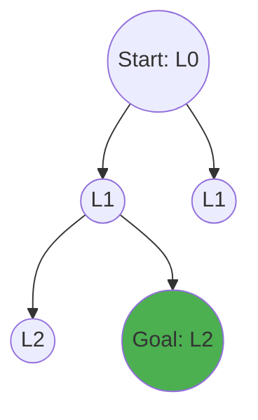

---

# ✅ **Artificial Intelligence and Data Science Solved Question Bank**

---

# 📘 **Module 4: Data Visualization**

## 🔹 **2 Marks Questions**

**1. Define data visualization as a graphical representation technique and explain its primary objective in data analysis.**
**Answer:** Data visualization is the graphical representation of information and data using visual elements like charts, graphs, and maps. Its primary objective in data analysis is to translate complex, high-volume data into a visual context, making it significantly easier for the human brain to identify trends, patterns, and outliers intuitively.

**2. Identify any two benefits of data visualization and explain how they support data-driven decision making.**
**Answer:** 
1. **Accelerated Insights:** Human brains process visuals much faster than text/spreadsheets, allowing decision-makers to grasp complex concepts instantly.
2. **Identifying Relationships:** Visualizations easily highlight correlations between independent variables, guiding executives to make informed, data-backed strategic choices rather than relying on intuition.

**3. Identify the type of data best represented using a histogram and justify its suitability for that data.**
**Answer:** **Continuous Numerical Data** is best represented using a histogram. It is highly suitable because a histogram groups continuous data into consecutive, non-overlapping intervals (bins), effectively visualizing the underlying frequency distribution, spread, and skewness of the dataset.

**4. Apply a countplot in Exploratory Data Analysis (EDA) to a given dataset and explain how it helps in understanding the distribution of categorical data.**
**Answer:** A countplot is applied to display the exact frequency/count of observations in each categorical bin using bars. In EDA, applying a countplot to a feature like "Customer Gender" instantly visualizes the class distribution, helping analysts quickly identify if the dataset is imbalanced (e.g., 80% Male, 20% Female) before training machine learning models.

**5. Identify any two common data visualization techniques used in data science. State one limitation of data visualization.**
**Answer:** 
- **Techniques:** Scatter Plots (for bivariate relationships) and Boxplots (for outlier detection).
- **Limitation:** Visualizations can be highly misleading or biased if scaled improperly or if the creator deliberately truncates the Y-axis to exaggerate minor differences.

**6. Explain the importance of data visualization in Artificial Intelligence and Data Science.**
**Answer:** In AI and DS, visualization acts as the bridge between complex mathematical modeling and human interpretation. It is crucial during EDA for spotting anomalies, feature selection (viewing correlations), and model evaluation (interpreting Confusion Matrices or ROC curves visually).

---

## 🔹 **5 Marks Questions**

**7. Analyze how visualization techniques assist in understanding patterns, trends, and model performance.**
**Answer:** 
- **Understanding Patterns:** Visualization techniques like Time-Series Line Charts clearly expose cyclical or seasonal patterns in data (e.g., higher sales every December) that are invisible in raw tables.
- **Understanding Trends:** Scatter plots combined with linear regression lines instantly reveal the overarching direction of data (e.g., as advertising budget increases, revenue universally trends upwards).
- **Evaluating Model Performance:** AI models output raw probabilities. Visualizing these outputs via Receiver Operating Characteristic (ROC) curves, Precision-Recall curves, or colorful Confusion Matrices allows data scientists to rapidly analyze false positive rates, classification accuracy, and model bias at a glance, drastically speeding up the optimization loop.

**8. Consider a real-world dataset (e.g., customer purchase or healthcare data). Develop an EDA strategy using appropriate visualization techniques to explore the dataset, detect patterns and anomalies, and provide meaningful insights. Justify your approach.**
**Answer:** 
**EDA Strategy for Customer Purchase Data:**
1. **Data Cleaning Verification:** Start by using a **Missingno Matrix** or a simple Heatmap to visualize missing values (NaNs). *Justification:* Ensures data integrity before deep analysis.
2. **Univariate Analysis (Single Variable):** Utilize **Histograms** to map customer age distribution and **Countplots** to view geographical distribution. *Justification:* Establishes the baseline demographic of the buyer pool.
3. **Bivariate Analysis (Two Variables):** Deploy **Scatter Plots** mapping "Age" vs "Total Spending Score". *Justification:* Detects behavioral clusters (e.g., discovering young users spend the most).
4. **Anomaly Detection:** Utilize **Boxplots** across categorical axes (e.g., Spending vs Gender). *Justification:* The "whiskers" of the boxplot instantly highlight extreme outliers (e.g., a single $10,000 purchase) that could severely skew predictive machine learning models.
5. **Multi-collinearity Check:** Generate a **Correlation Matrix Heatmap** for all numerical variables. *Justification:* If two features are highly correlated (e.g., "Items Bought" and "Total Bill"), one can be safely dropped during feature engineering to simplify the AI model.

---

# 📘 **Module 5: Problem Solving in AI**

## 🔹 **2 Marks Questions**

**1. Recall the concept of state space representation in the 8-puzzle problem and identify its key elements such as initial state, goal state, and operators with a brief explanation.**
**Answer:** 
- **Initial State:** The starting, scrambled configuration of the 8 numbered tiles.
- **Goal State:** The specifically desired, ordered configuration of the tiles (1 through 8 in sequence).
- **Operators:** The valid moves available: sliding the blank space *Up, Down, Left, or Right* into adjacent tiles.

**2. Explore the constraints of the 8-Queens problem and describe how they ensure that no two queens attack each other on the chessboard.**
**Answer:** The constraints are mathematically strictly defined: 
1. No two queens share the same row.
2. No two queens share the same column.
3. No two queens share the same diagonal path.
By algorithmically checking these constraints before placing a new queen, the system ensures complete board validity based on chess rules.

**3. Explain the role of heuristic functions in A* search and describe how they influence search efficiency and optimality.**
**Answer:** A heuristic function `h(n)` intelligently estimates the cheapest cost from the current node `n` directly to the goal. It massively boosts efficiency by guiding the search algorithm selectively towards promising nodes. If the heuristic is *admissible* (never overestimates the true cost), A* is mathematically guaranteed to find the absolute optimal shortest path.

**4. Analyze the role of fitness function in genetic algorithms and explain how it helps in selecting better solutions during evolution.**
**Answer:** The fitness function evaluates and assigns a quantitative score to each individual "chromosome" (solution) based on how close it is to solving the target problem. It acts as the environment's survival pressure, ensuring that only the highest-scoring, "fittest" solutions are selected to reproduce and pass their superior traits to the next generation.

---

## 🔹 **5 Marks Questions**

**5. Apply Breadth First Search (BFS) to explain how nodes are expanded level by level and illustrate how it finds the shortest path in a simple scenario.**
**Answer:** 
BFS explores a search space systematically using a First-In-First-Out (FIFO) queue. It starts at the root node (Level 0), expands all its immediate neighbor nodes (Level 1), and completely explores them before moving downwards to Level 2.
Because BFS strictly exhausts all nodes at depth `d` before investigating depth `d+1`, the very first time it encounters the goal node, it is mathematically guaranteed to be the shortest path in an unweighted graph, as all shorter paths have already been conclusively checked.

**6. Analyze the working of Depth First Search (DFS) and explain why it may fail to find optimal solutions in certain problem spaces.**
**Answer:** 
DFS operates using a Last-In-First-Out (LIFO) stack. It dives as deeply as aggressively possible down a single branch of the search tree until it hits a dead end, at which point it backtracks up one step and tries the next branch.
**Why it fails to find optimal solutions:** DFS blindly pursues depth. In an unweighted graph where the goal is just one step to the right of the root, DFS might first choose the left branch, descending thousands of levels deep and finding a massively convoluted, long path to the goal, entirely missing the optimal 1-step solution. Furthermore, in infinite or cyclic graphs without depth limits, DFS can get trapped in an endless loop forever.

**7. Apply the concept of hill climbing algorithm to explain how solutions improve iteratively, and describe one situation where it gets stuck at a local optimum.**
**Answer:** 
Hill Climbing is a local search optimization algorithm. It begins with a random solution and iteratively makes small, incremental changes to the state. It evaluates the neighboring states and always explicitly moves to the neighbor with the highest objective value (climbing upwards). It terminates when no neighbor has a higher value.
**Getting Stuck:** It easily gets stuck at a **Local Optimum**. This is a peak state that is higher than all its immediate neighbors, but lower than the absolute highest peak (Global Optimum). Because Hill Climbing only looks locally and refuses to make downward moves (no backtracking), it gets trapped on the smaller peak forever.

**8. Apply the concept of state space formulation to the 8-puzzle problem and illustrate how operators transform the initial state toward the goal state. How does the choice of representation affect search efficiency?**
**Answer:** 
- **Formulation:** A state is represented as a 3x3 matrix. Operators are applied to the coordinates of the "Blank" space [x, y]. If the operator is "Move Blank UP", the state transforms by swapping the blank space at `[x, y]` with the tile at `[x-1, y]`.
- **Representation Impact:** If represented as a flat 1D array `[1, 2, 3, 4, 5, 6, 7, 8, 0]`, calculating legal moves requires modular arithmetic, whereas a 2D array makes boundary checking easier. A highly optimized bit-string representation drastically reduces memory overhead per node, allowing the AI to keep millions of expanded states in RAM, exponentially increasing search efficiency and speed.

**9. Analyze the 8-Queens problem and how constraints eliminate invalid solutions using backtracking. Explain how this approach improves efficiency compared to brute force.**
**Answer:** 
- **Backtracking Application:** The algorithm places Queen 1 in Row 1. It then attempts to place Queen 2 in Row 2. Before placing, it explicitly checks the constraints (no column/diagonal attack). If a constraint is violated, it skips that square. If a row has no valid squares left, the algorithm *backtracks*, removes the previously placed Queen, and moves her to the next slot.
- **Efficiency Improvement:** A brute force algorithm generates all possible board configurations ($64^8$) and evaluates them at the end. Backtracking evaluates *during* generation. If placing two queens creates an invalid board, backtracking immediately discards it, dynamically pruning millions of downstream invalid branches from the search tree, saving massive computational time.

**10. Apply Breadth First Search (BFS) to a simple graph problem and illustrate step-by-step node expansion. Why does BFS guarantee optimal solutions in unweighted graphs?**
**Answer:** 
*Scenario:* Find path from A to Goal (G). Nodes connected: A-(B,C), B-(D), C-(G).
*Step-by-step:*
1. Initialize Queue: `[A]`
2. Dequeue A, Expand A. Queue: `[B, C]`
3. Dequeue B, Expand B. Queue: `[C, D]`
4. Dequeue C, Expand C. Goal `G` found! Path: A -> C -> G.
*Guarantee of Optimality:* BFS operates radially like a ripple in water. It exhaustively checks all paths of length 1, then all paths of length 2, etc. Therefore, it is impossible for BFS to discover a path of length 3 to the goal before discovering a path of length 2. The first time the goal is reached, it is mathematically the shortest path.

**11. Analyze Depth First Search (DFS) by applying it to a problem graph and explain situations where it may fail to find optimal or complete solutions.**
**Answer:** 
*Application:* DFS aggressively navigates down one specific path.
*Failure Situations:*
1. **Failing Completeness (Infinite Trees):** If a search space has a branch with infinite depth (or a cyclical loop without memory tracking), DFS will descend down that branch indefinitely. Even if the goal exists on a neighboring branch, DFS will never backtrack far enough to find it, rendering it incomplete.
2. **Failing Optimality:** DFS does not evaluate path cost. If the goal exists at depth 1 on the right branch, but DFS randomly selects the left branch first, it may find an alternative route to the goal at depth 100. It will return the depth-100 path as the solution, completely missing the optimal depth-1 path.

**12. Apply A* search algorithm to a pathfinding problem by computing evaluation function values and selecting nodes. Interpret how heuristic accuracy impacts optimality.**
**Answer:** 
A* evaluates nodes by combining actual past cost `g(n)` and estimated future cost `h(n)` using the formula: `f(n) = g(n) + h(n)`.
*Application:* Node X has `g(X) = 5`, heuristic `h(X) = 2`. `f(X) = 7`. Node Y has `g(Y) = 2`, `h(Y) = 8`. `f(Y) = 10`. A* selects and expands Node X because 7 < 10.
*Heuristic Accuracy Impact:* 
- If `h(n)` is exactly perfectly accurate, A* goes straight to the goal without expanding any useless nodes (Lightning fast).
- If `h(n)` is **admissible** (optimistic; it never overestimates the real distance), A* is mathematically guaranteed to eventually find the optimal shortest path.
- If `h(n)` overestimates the distance, A* loses its optimality guarantee and may return a suboptimal, longer path.

**13. Apply the Travelling Salesman Problem formulation to a small example and check the different approaches to minimize travel cost. Discuss limitations of exact methods.**
**Answer:** 
*Formulation:* A salesman must visit 4 cities (A, B, C, D) exactly once and return to the start, minimizing total distance. State: Current city + unvisited cities.
*Approaches:*
- **Brute Force:** Generate all possible permutations of city visits (A-B-C-D-A, A-C-B-D-A, etc.) and calculate the total cost for each, selecting the minimum.
- **Limitations of Exact Methods:** The time complexity for brute force is $O(n!)$. For 4 cities, it's trivial (24 paths). For just 20 cities, it requires evaluating $2.4 \times 10^{18}$ paths, taking centuries on modern supercomputers. Therefore, exact methods are completely limited by the combinatorial explosion of the search space.

**14. Apply hill climbing algorithm to an optimization problem and demonstrate how local maxima and plateau conditions affect solution quality.**
**Answer:** 
*Scenario:* An AI tuning a robotic arm's angle to achieve maximum lifting power.
- **Local Maxima:** The algorithm tweaks the angle and power increases. It reaches an angle of 45° where tweaking it up or down decreases power. It stops, assuming this is the best. However, an entirely different configuration at 120° yields double the power (Global Maxima). The solution quality is poor because the AI gets trapped on the smaller "hill".
- **Plateau Condition:** The algorithm enters a flat landscape where changing the angle from 50° to 60° yields absolutely no change in power. The algorithm has no gradient to guide it, resulting in a random, directionless walk that wastes computational time without improving the solution.

---

# 📘 **Module 6: Sustainable Agriculture and Food Systems**

## 🔹 **2 Marks Questions**

**1. Define sustainable agriculture and identify its key objectives related to environmental protection, economic profitability, and social equity.**
**Answer:** Sustainable agriculture is farming in sustainable ways meeting society's present food needs without compromising the ability of future generations to meet their own. Its objectives are to preserve environmental health (conserving water/soil), ensure economic profitability for the farm, and promote social equity (fair labor conditions and community health).

**2. Describe the concept of precision farming and explain how it improves resource utilization.**
**Answer:** Precision farming utilizes advanced technology like IoT sensors, GPS, and drones to observe and measure variations in fields. It improves resource utilization by applying exact amounts of water, pesticides, and fertilizers strictly to the specific micro-areas that need it, minimizing massive chemical waste and environmental runoff.

**3. Analyze the impact of climate change on agriculture and examine its effect on food security.**
**Answer:** Climate change induces extreme weather patterns, prolonged droughts, and shifts in pest habitats. This dramatically reduces agricultural crop yields globally, directly threatening food security by severely lowering long-term food availability and destabilizing market prices.

---

## 🔹 **5 Marks Questions**

**4. Compare the differences between local and global food systems and illustrate their key characteristics in terms of production, distribution, and consumption.**
**Answer:** 
- **Global Food Systems:** Prioritize massive-scale industrial production and monoculture. *Distribution* relies on complex, high-emission international supply chains. *Consumption* features highly processed, year-round available foods. They are highly efficient but environmentally taxing.
- **Local Food Systems:** Prioritize small-scale, diversified farm production. *Distribution* utilizes short supply chains (e.g., Farmer's Markets) with a minimal carbon footprint. *Consumption* focuses on seasonal, fresh produce, directly keeping economic profits within the local community.

**5. Apply data science techniques to demonstrate how data collection improves agricultural decision-making.**
**Answer:** By deploying IoT soil moisture sensors, weather API integrations, and drone imagery, farms generate massive datasets. Applying Data Science techniques like Machine Learning to this data allows algorithms to predict exact optimal harvesting windows, automate irrigation systems specifically when the soil is dry, and preemptively detect crop diseases weeks before they become visible to the human eye, shifting farming from reactive guesswork to proactive precision.

**6. Demonstrate the use of data science techniques in logistics to improve efficiency in food supply chains.**
**Answer:** Data science drastically optimizes food logistics. Predictive analytics analyze historical consumer purchasing data to forecast future demand, ensuring supermarkets do not over-order perishable goods. Furthermore, AI-driven Route Optimization algorithms calculate the fastest, most fuel-efficient delivery paths for cold-chain trucks by analyzing live traffic data. This minimizes transit times, drastically reducing spoilage and diesel emissions.

**7. Examine challenges such as food wastage and supply chain inefficiencies and justify the need for data-driven solutions.**
**Answer:** Currently, nearly 30% of global food produced is wasted due to horrific supply chain inefficiencies, improper storage, and inaccurate demand forecasting. Manual oversight is insufficient to track millions of perishable items. Data-driven solutions are strictly justified because real-time IoT tracking, blockchain traceability, and AI demand forecasting can dynamically match supply to exact consumer demand, virtually eliminating overproduction and logistical rotting.

**8. Examine the dimensions of sustainable agriculture and analyze its key roles in ensuring environmental sustainability, economic profitability, and social equity.**
**Answer:** 
- **Environmental:** Agriculture must actively regenerate soil biodiversity and limit toxic chemical runoff to ensure the land remains fertile for centuries.
- **Economic:** Farms must remain financially viable. Sustainable practices reduce reliance on expensive chemical fertilizers, improving long-term profit margins.
- **Social:** Ensures agricultural workers receive fair, living wages and safe working conditions devoid of hazardous chemical exposure, fostering thriving rural communities. True sustainability requires all three pillars acting synchronously.

**9. Analyze the definition and dimensions of food security and examine the role of sustainable agriculture in ensuring long-term food availability.**
**Answer:** Food security exists when all people have constant physical and economic access to nutritious food. Its dimensions are: *Availability, Access, Utilization, and Stability*. Sustainable agriculture plays the most critical role in the "Stability" dimension. By preserving soil health and local water tables rather than depleting them, sustainable farming guarantees that agricultural yields will remain consistently high decades into the future, securing long-term food availability.

**10. Investigate different types of food systems and analyze the differences between global and local food systems in terms of efficiency and sustainability.**
**Answer:** 
- **Global Systems (Industrial):** Exceptionally efficient regarding sheer output volume and driving down consumer prices. However, they are highly unsustainable, heavily reliant on fossil fuels for international transport, and cause severe deforestation.
- **Local Systems:** Highly sustainable, featuring minimal transport emissions and organic practices that preserve local ecology. However, they lack the efficiency of scale, often resulting in lower overall yields and slightly higher prices, struggling to independently feed massive mega-cities.

**11. Demonstrate the concept of food systems by explaining its definition and applying its elements in real-world agricultural scenarios.**
**Answer:** A food system encompasses all processes and infrastructure involved in feeding a population. 
*Real-world scenario (The Tomato System):* 
1. **Production:** Seeds planted, irrigated, and harvested on a farm.
2. **Processing:** Tomatoes transported to a factory, washed, and canned into sauce.
3. **Distribution:** Cans shipped via rail and trucks to supermarket warehouses.
4. **Consumption:** Purchased and eaten by a family.
5. **Waste Management:** The empty tin can is recycled; food scraps are composted back into agricultural soil.

**12. Examine the components of the food system and analyze their interdependence in ensuring food supply.**
**Answer:** The components (Production, Processing, Distribution, Retail, Consumption) are deeply intertwined. A shock to one component instantly cascades. For example, if a severe drought impacts *Production* (low wheat yield), *Processing* plants lack raw materials, causing bread prices to skyrocket in *Retail*, directly threatening *Consumption* access for low-income families. Resilience requires robust connections across all sectors.

**13. Investigate the challenges in feeding a growing population such as climate change, water scarcity, and food wastage, and analyze their impact on agriculture.**
**Answer:** The global population will reach 10 billion by 2050, requiring a 60% increase in food production. 
- **Climate Change:** Shifts weather, reducing the total amount of arable land available. 
- **Water Scarcity:** Agriculture already consumes 70% of global freshwater; expanding production linearly will drain global aquifers entirely.
- **Impact:** These compounding challenges mandate a total paradigm shift away from traditional farming. Agriculture is being forced to rapidly adopt high-tech precision AI, drought-resistant genetically modified crops, and strict wastage reduction pipelines simply to survive.
